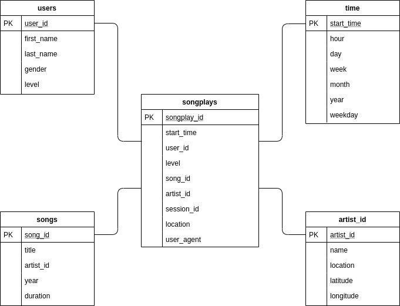

## Data Modeling with Postgres

### Project summary
A startup called Sparkify wants to analyze the data they've been collecting on songs and user activity on their new music streaming app. The analytics team is particularly interested in understanding what songs users are listening to. Currently, they don't have an easy way to query their data, which resides in a directory of JSON logs on user activity on the app, as well as a directory with JSON metadata on the songs in their app.

This project creates a Postgres database with tables designed to optimize queries on song play analysis. First, fact and dimension tables for a star schema are defined. Then, a database for storing music and artist records is created. Finally, an ETL pipeline is creted to transfer data from files into these data tables in Postgres using Python, Pandas and SQL.

### Required libraries

- pandas
- psycopg2
- sql_queries

### Python scripts

- create_tables.py: Clean previous schema and creates tables.
- sql_queries.py: All queries used in the ETL pipeline.
- etl.py: Read JSON logs and JSON metadata and load the data into generated tables.


### Database Schema
<p align="center">
  
</p>


### Usage

Create tables and execute ETL.
```
$ python3 create_tables.py
$ python3 etl.py
```

### Check results
Results can be tested by running the code cells inside the jupyter notebook:
```
test.ipynb
```
